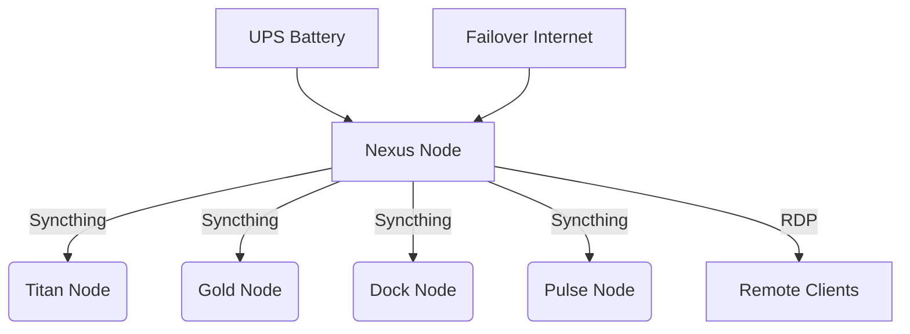

# **🖥  Nexus Node Deployment Log**  
**📅 Date:** July 12, 2025  
**👨‍💻 SysAdmin:** Sasha Zimin  

### **🌐 Deployment Overview**  
- **Project:** `prj-server-nexus-node`  
- **Role:** Central Sync Hub & Remote Access Gateway  
- **Security:** Firewall-controlled connections  

---

## **📜 Step-by-Step Logs**  

### **1️⃣ System Installation**  
```log
2025-07-12T09:00:00Z | Windows 11 Pro installed  
2025-07-12T09:30:00Z | Disk partitioned:  
- EFI (300MB)  
- MSR (16MB)  
- Windows (475GB)  
2025-07-12T10:00:00Z | Network configured (Static IP)  
```

### **2️⃣ Core Services Setup**  
```log
2025-07-12T11:00:00Z | Syncthing v1.27 installed  
2025-07-12T11:30:00Z | RDP configured (Port 3389)  
2025-07-12T12:00:00Z | 4G failover activated  
2025-07-12T12:30:00Z | Firewall rules applied:  
- Syncthing (TCP:22000)  
- RDP (TCP:3389)  
```

### **3️⃣ Node Connections**  
```log
2025-07-12T13:00:00Z | Paired devices:  
- Titan Node (Desktop)  
- Gold Node (Laptop)  
- Dock Node (Laptop)  
- Pulse Node (Mobile)  
```

---

## **🔗 Network Diagram**  


---

## **🧪 Post-Deployment Checks**  

### **1️⃣ Connectivity Tests**  
```log
2025-07-12T14:00:00Z | Syncthing ports: Active (TCP:22000)  
2025-07-12T14:05:00Z | RDP access: Verified (TCP:3389)  
```

### **2️⃣ System Metrics**  
```log
2025-07-12T14:10:00Z | Initial readings:  
- CPU Load: 12%  
- Memory Usage: 4.2/8GB  
- Storage: 78/512GB  
- Uptime: 0 days 5:00:00  
```

---

## **✅ Final Checklist**  
| **Step**               | **Status** |  
|------------------------|------------|  
| OS Installed           | ✅         |  
| Services Configured    | ✅         |  
| Nodes Paired           | ✅         |  
| Firewall Active        | ✅         |  
| Backup Power Ready     | ✅         |  

**🕒 Deployment completed at:** 2025-07-12T14:30:00Z  

*Note: All connections are protected by firewall rules. Sensitive details have been redacted for security.*
